<!--
  Profile README for Venkat Sai Subash Panchakarla
  Drop this file into a GitHub repository named exactly: venkatsubash2003
  File name must be: README.md
-->

<p align="center">
  
</p>

<p align="center">
  <a href="mailto:venkatsaisubash.2003@gmail.com"></a>
  <a href="https://www.linkedin.com/in/venkat-sai-subash-panchakarla-b166ba23a"></a>
  <a href="https://github.com/venkatsubash2003"></a>
  
</p>

<p align="center">
  
</p>

---

<table>
<tr>
<td width="58%" valign="top">

## `SYSTEM.IDENTITY`

```yaml
name: Venkat Sai Subash Panchakarla
base: Cincinnati, Ohio, USA
signal: AI/ML Engineer + Data Systems Builder
education: M.S. Information Technology, University of Cincinnati | GPA 4.0
mission: Build high-impact AI systems that bridge research and production
specialties:
  - Low-latency LLM inference
  - Retrieval-Augmented Generation pipelines
  - Distributed vector search
  - Cloud-native MLOps
  - ML-ready data engineering
```

</td>
<td width="42%" valign="top">

## `LIVE.METRICS`

<p align="center">
  
  
  
  
  
</p>

> I design AI products like infrastructure: measurable, observable, scalable, and useful.

</td>
</tr>
</table>

---

## `AI_SYSTEM_BLUEPRINT`

```mermaid
flowchart LR
    A[Raw Data] --> B[ETL / ELT Pipelines]
    B --> C[Validation + Anomaly Detection]
    C --> D[Feature Store]
    D --> E[Embeddings + Vector Index]
    E --> F[RAG Orchestration]
    F --> G[LLM Inference Layer]
    G --> H[FastAPI / Streamlit Apps]
    H --> I[Evaluation + Feedback Loop]
    I --> C

    style A fill:#020617,stroke:#22d3ee,color:#e5e7eb
    style F fill:#312e81,stroke:#a78bfa,color:#ffffff
    style G fill:#064e3b,stroke:#34d399,color:#ffffff
    style I fill:#451a03,stroke:#fbbf24,color:#ffffff
```



---

## `TECH_ARSENAL`

<p align="center">
  
</p>

<p align="center">
  
  
  
  
  
  
  
  
  
  
  
  
</p>

<table>
<tr>
<td valign="top" width="33%">

### Intelligence Layer
`Llama 3.1` · `BERT` · `Transformers` · `LoRA/PEFT` · `Prompt Engineering` · `LLM Evaluation` · `Model Quantization`

</td>
<td valign="top" width="33%">

### Retrieval Layer
`RAG` · `FAISS` · `Pinecone` · `Weaviate` · `Embeddings` · `Semantic Chunking` · `Ranked Retrieval`

</td>
<td valign="top" width="33%">

### Production Layer
`FastAPI` · `Docker` · `Kubernetes` · `AWS` · `Azure` · `CI/CD` · `Prometheus` · `Grafana`

</td>
</tr>
</table>

---

## `FEATURED_BUILDS`

<table>
<tr>
<td width="50%" valign="top">

### 🚀 CareerPilot AI

AI job-application copilot for international students.

**Core:** LangChain · Ollama Llama 3.1 · Streamlit · Python · SQLite  
**Ships:** visa sponsorship classification, H1B history lookup, ATS scoring, resume/JD fit analysis, cover letters, recruiter emails  
**Impact:** reduced manual job research effort by ~70%

<p align="left">
  
  
  
</p>

</td>
<td width="50%" valign="top">

### 📚 LLM Research Paper Analysis Engine

AI platform for summarizing, clustering, and comparing research papers.

**Core:** LangChain · FastAPI · Python · NLP  
**Ships:** semantic summarization, comparison workflows, insight extraction  
**Impact:** cut manual review effort by ~75% and improved insight extraction quality by ~45%

<p align="left">
  
  
  
</p>

</td>
</tr>
<tr>
<td width="50%" valign="top">

### 🧬 Crime Similarity & Risk Prediction System

Unsupervised deep-learning system for pattern detection across large-scale crime records.

**Core:** AutoEncoders · Scikit-learn · Python  
**Ships:** normalization, imputation, encoding, similarity scoring, real-time risk signals  
**Impact:** processed 2M+ records and improved pattern detection accuracy by ~35%

<p align="left">
  
  
  
</p>

</td>
<td width="50%" valign="top">

### 📊 Farmers Market Analytics Dashboard

AI-assisted analytics system for stakeholder reporting and KPI tracking.

**Core:** Tableau · BigQuery · SQL · Smartsheets · Python · Scikit-learn  
**Ships:** unified datasets, automated KPI tracking, vendor engagement insights, attendee demographics, benefits utilization  
**Impact:** improved reporting efficiency by ~45% and reduced manual reporting effort by ~60%

<p align="left">
  
  
  
</p>

</td>
</tr>
</table>

---

## `EXPERIENCE_TRACE`

<table>
<tr>
<td width="50%" valign="top">

### 🏛️ ML Engineer / Data Analyst
**University of Cincinnati** · Cincinnati, OH  
`Mar 2025 - Present`

- Built ML-ready data pipelines across Snowflake, BigQuery, and cloud-native ETL workflows.
- Developed schema validation and anomaly detection systems to improve model reliability.
- Engineered reusable feature stores that made experimentation faster and more reproducible.
- Improved monitoring and observability with Grafana and Prometheus.

</td>
<td width="50%" valign="top">

### ⚡ AI/ML Engineer Intern
**Cybereconn** · Gurgaon, India  
`Apr 2023 - Apr 2024`

- Optimized low-latency Llama 3.1 and BERT inference pipelines.
- Built semantic retrieval architectures with BERT embeddings and evaluation loops.
- Developed FastAPI services for real-time LLM inference and retrieval.
- Integrated FAISS-powered RAG pipelines for larger, faster knowledge bases.

</td>
</tr>
</table>

---

## `GITHUB_TELEMETRY`

<p align="center">
  
  
</p>

<p align="center">
  
</p>

<p align="center">
  
</p>

---

## `CURRENTLY_COMPILING`

```txt
[01] Production-grade RAG systems with measurable retrieval quality
[02] Faster LLM serving with vLLM, TensorRT, quantization, and batching
[03] AI evaluation pipelines that detect hallucinations, drift, and weak answers
[04] Feature stores and ML-ready data pipelines for repeatable experimentation
[05] Agentic workflows that are useful, observable, and safe to operate
```

---

## `OPERATING_PRINCIPLES`

<table>
<tr>
<td align="center" width="25%">

### 🧪 Measure
No AI claim is real until it survives evaluation.

</td>
<td align="center" width="25%">

### ⚙️ Optimize
Latency, throughput, cost, and reliability all matter.

</td>
<td align="center" width="25%">

### 🧭 Ground
RAG systems should retrieve, reason, cite, and improve.

</td>
<td align="center" width="25%">

### 🚢 Ship
The best model is the one users can actually use.

</td>
</tr>
</table>

---

<p align="center">
  
</p>

<h3 align="center">Let's build AI that is fast, grounded, and production-ready.</h3>

<p align="center">
  <a href="mailto:venkatsaisubash.2003@gmail.com"></a>
  <a href="https://www.linkedin.com/in/venkat-sai-subash-panchakarla-b166ba23a"></a>
</p>

<p align="center">
  
</p>
